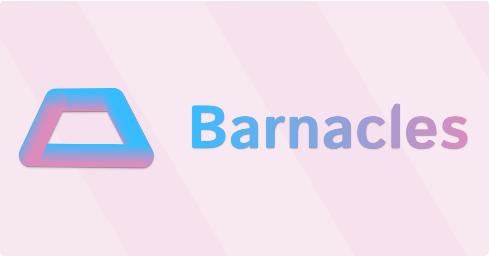

# Barnacles

A desktop application for developers to organize, manage, and analyze their coding projects. Barnacles automatically scans directories, detects technologies, tracks project metadata, and provides integrated terminals and IDE access.

Barnacles provides tools for everyday development. Easily find, open, or start your projects from a single interface.

## Download

You can download the latest release for your platform from the [Releases](https://github.com/jcz530/barnacles/releases) page.

## Features

- **Project Discovery** - Automatically scan directories to find and catalog all your development projects
- **Technology Detection** - Identify technologies, frameworks, and languages used in each project
- **Project Analytics** - View file counts, lines of code, language breakdowns, and project statistics
- **Git Integration** - Track branch status, commits, and repository information
- **Process Management** - Start, stop, and monitor project processes with saved configurations
- **Integrated Terminals** - Launch terminals directly in project directories
- **IDE Integration** - Quick access to open projects in your preferred IDE
- **Search & Filter** - Fuzzy search and filter projects by technology
- **Favorites** - Mark and quickly access your most-used projects
- **Command Line Interface** - Manage projects and processes from the terminal ([CLI Documentation](src/cli/README.md))

## Technology Stack

- **Electron** - Cross-platform desktop app framework
- **Vue 3** - Progressive frontend framework with Composition API
- **Hono** - Lightweight web framework for the backend API
- **TypeScript** - Full type safety across the entire application
- **shadcn-vue** - Modern UI component library
- **Tailwind CSS** - Utility-first CSS framework
- **Drizzle ORM** - Type-safe database access with SQLite

## Architecture

The application uses a single-process architecture with four main components:

```
src/
├── main/           # Electron main process (window management, lifecycle)
├── backend/        # Hono API server on port 51000-51010
│   ├── routes/     # REST API endpoints
│   └── services/   # Business logic (scanning, detection, terminals)
├── frontend/       # Vue.js application
│   ├── components/ # UI components (atomic design pattern)
│   ├── views/      # Page-level components
│   └── composables/# Reusable Vue composition functions
├── cli/            # Command-line interface
│   ├── commands/   # CLI commands (projects, status, open)
│   ├── actions/    # Project actions (start, stop, terminal)
│   └── utils/      # CLI utilities and helpers
├── shared/         # Common types and utilities
└── preload.ts      # IPC bridge script
```

## Getting Started

### Prerequisites

- Node.js 18 or higher
- npm or yarn
- [node-pyt dependencies](https://www.npmjs.com/package/node-pty#dependencies)
  - Mac: Xcode needs to be installed 

### Installation

1. Clone this repository:

```bash
git clone https://github.com/yourusername/barnacles.git
cd barnacles
```

2. Install dependencies:

```bash
npm install
```

3. Start the application:

```bash
npm run dev
```

The application will launch with:

- Electron window displaying the Barnacles UI
- Hono API server running on `localhost:51000-51010` (automatically finds available port)
- Hot reload enabled for development

### First-Time Setup

1. Open the Settings page to configure:
   - Default terminal application
   - Default IDE/code editor
   - Project scan depth (how many directory levels to search)

2. Navigate to the Projects page and click "Scan" to discover projects on your system

3. Browse, search, and organize your projects!

## Command Line Interface

Barnacles includes a powerful CLI for managing projects from the terminal. The `barnacles` command is automatically available after installation.

### Quick Examples

```bash
# Browse and manage projects interactively
barnacles projects

# Check Barnacles status
barnacles status

# Open the Barnacles app
barnacles open

# Get help
barnacles --help
```

### Key Features

- **Interactive Project Browser** - Select and manage projects with an intuitive terminal UI
- **Process Management** - Start and stop project processes from the command line
- **Auto-Launch** - Automatically launches the Barnacles app if it's not running
- **Script Detection** - Automatically detects and suggests scripts from `package.json` and `composer.json`

For complete CLI documentation, see [src/cli/README.md](src/cli/README.md).

## Development Commands

| Command               | Description                                       |
|-----------------------|---------------------------------------------------|
| `npm run dev`         | Start the app in development mode with hot reload |
| `npm run dev:cli`     | Build and run the CLI in development mode         |
| `npm run start`       | Start the app from built files (production-like)  |
| `npm run build`       | Build all components for production               |
| `npm run build:cli`   | Build the CLI for production                      |
| `npm run lint`        | Run ESLint on the source code                     |
| `npm run lint:fix`    | Run ESLint and automatically fix issues           |
| `npm run format`      | Format code with Prettier                         |
| `npm run type-check`  | Run TypeScript type checking                      |
| `npm run db:generate` | Generate database migrations                      |
| `npm run db:migrate`  | Run database migrations                           |
| `npm run dist`        | Build distributable packages for all platforms    |

## How It Works

### Project Scanning

Barnacles scans your file system to discover development projects by looking for common indicators like:

- `package.json` (JavaScript/TypeScript)
- `Cargo.toml` (Rust)
- `go.mod` (Go)
- `requirements.txt` (Python)
- `pom.xml` (Java/Maven)
- `.git` directories

### Technology Detection

For each project, Barnacles automatically detects:

- Programming languages and frameworks
- Build tools and package managers
- Testing frameworks
- Version control status
- File statistics and lines of code

### Data Management

- Projects are stored in a local SQLite database using Drizzle ORM
- File system scanning is non-intrusive (read-only)
- Project metadata is cached and can be refreshed on demand

## Building for Production

Build platform-specific distributables:

```bash
npm run dist        # Build for current platform
npm run dist:mac    # Build for macOS
npm run dist:win    # Build for Windows
npm run dist:linux  # Build for Linux
```

## Contributing

Contributions are welcome! Please feel free to submit a Pull Request.

### Development Guidelines

- Follow the atomic design pattern for components
- Use TypeScript for type safety
- Keep files under 500 lines
- Use TanStack Query for API calls
- Use VueUse for common composables
- See `CLAUDE.md` for detailed development guidelines

## Project Structure

```
barnacles/
├── src/
│   ├── backend/              # Hono API server
│   │   ├── routes/           # API route handlers
│   │   ├── services/         # Business logic
│   │   └── middleware/       # Request middleware
│   ├── frontend/             # Vue.js application
│   │   ├── components/       # Reusable UI components
│   │   │   ├── atoms/        # Basic elements
│   │   │   ├── molecules/    # Simple component groups
│   │   │   ├── organisms/    # Complex components
│   │   │   └── ui/           # shadcn-vue components
│   │   ├── views/            # Page components
│   │   ├── composables/      # Vue composition functions
│   │   └── router/           # Vue Router configuration
│   ├── cli/                  # Command-line interface
│   │   ├── commands/         # CLI commands
│   │   ├── actions/          # Project actions
│   │   ├── utils/            # CLI utilities
│   │   └── core/             # Base classes
│   ├── main/                 # Electron main process
│   ├── shared/               # Shared types and utilities
│   └── preload.ts           # Electron preload script
├── scripts/                  # Build and utility scripts
└── drizzle/                 # Database migrations
```

## Author

Created by [Joe Czubiak](https://joeczubiak.com)
