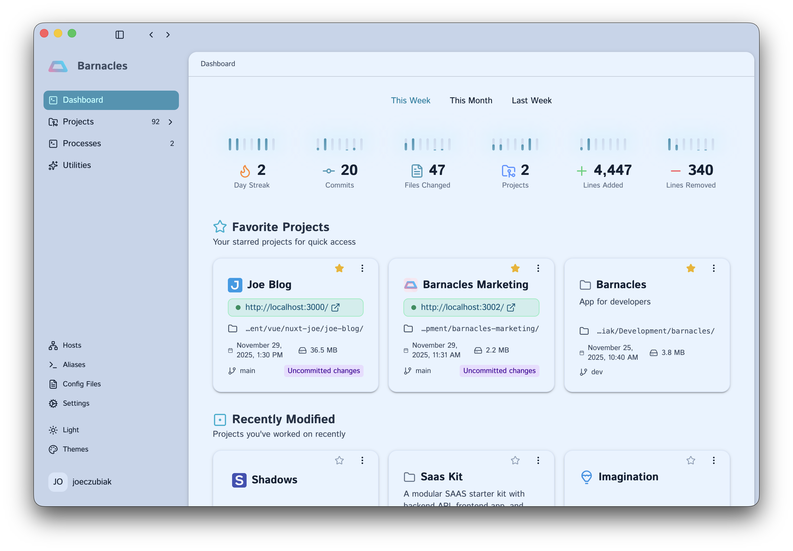
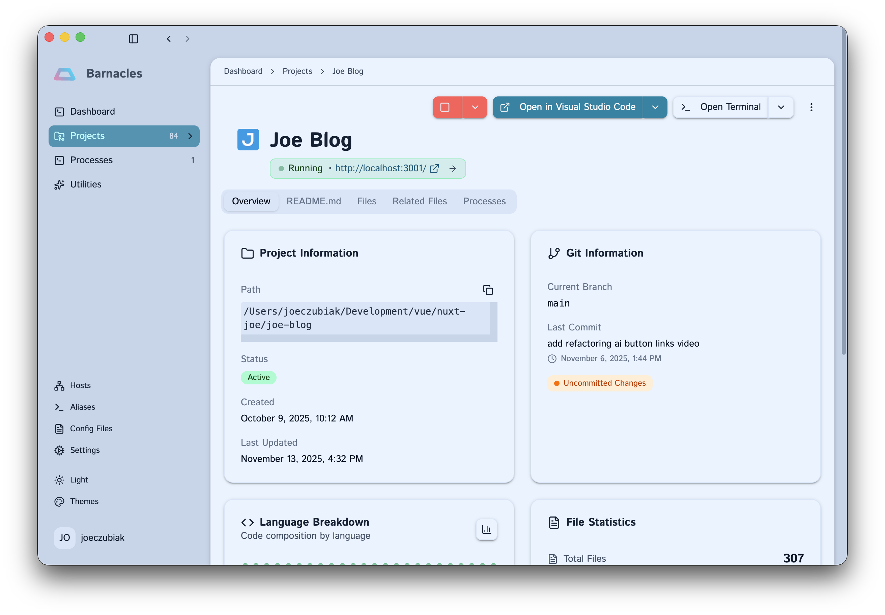

# Barnacles

**Life as a developer doesn't need to be so hard**

If you've developed for any amount of time you know how quickly barnacles (projects) attach to you. This app is there to help.  

Barnacles is both a desktop application and command-line tool that helps developers manage all their coding projects and local development settings like terminal aliases and host file entries.


## Download

**[Download for macOS](https://github.com/jcz530/barnacles/releases)**

Available for macOS. Other platforms coming soon (get involved to speed it up).



## Why Barnacles?

If you're juggling multiple projects across different directories, Barnacles keeps everything organized:

- **Find any project instantly** with fuzzy search across all your development directories
- **See what's happening** with automatic Git status tracking and project analytics
- **Launch faster** with quick access to terminals, IDEs, and favorite projects
- **Stay organized** with automatic technology detection and filtering
- **Work from anywhere** with both a GUI app and command-line interface

<!-- Screenshot: Project detail view showing Git info, stats, and quick actions -->


## Features

### 🔍 Automatic Project Discovery

Scan your file system once and Barnacles catalogs all your projects. It recognizes:
- JavaScript/TypeScript (package.json)
- Python (requirements.txt, pyproject.toml)
- Rust (Cargo.toml)
- Go (go.mod)
- Java (pom.xml)
- And any Git repository

### 📊 Project Insights

See at a glance:
- Lines of code and file statistics
- Language breakdown and technologies used
- Git branch, commits, and repository status
- Last modified date and activity

<!-- Screenshot: Technology detection and analytics view -->


### ⚡ Quick Actions

Launch what you need instantly:
- Open in your preferred IDE (VS Code, Cursor, WebStorm, etc.)
- Start integrated terminal in project directory
- Start and stop project processes with saved configurations
- Mark favorites for quick access

### 🎯 Powerful Search

- Fuzzy search finds projects by name instantly
- Filter by technology, language, or framework
- Sort by last modified, name, or creation date

### 💻 Command Line Interface

Prefer the terminal? Barnacles includes a full-featured CLI:

```bash
# Browse projects interactively
barnacles projects

# Check status
barnacles status

# Open the app
barnacles open
```

[View CLI Documentation →](src/cli/README.md)

<!-- Screenshot: CLI in action -->

## Getting Started

### Installation

1. **Download** the app for your platform from the [Releases page](https://github.com/jcz530/barnacles/releases)
2. **Install** by opening the downloaded file and following the prompts
3. **Launch** Barnacles from your Applications folder or Start menu

### First-Time Setup

When you first open Barnacles:

1. **Configure Settings**
   - Choose your default terminal application
   - Select your preferred IDE
   - Set project scan depth (how deep to search for projects)

2. **Scan for Projects**
   - Navigate to the Projects page
   - Click "Scan" to discover all your development projects
   - Barnacles will automatically detect technologies and gather metadata

3. **Start Managing**
   - Browse, search, and organize your projects
   - Mark favorites for quick access
   - Launch terminals, IDEs, and processes with one click

<!-- Screenshot: Settings page -->

## How It Works

Barnacles runs locally on your machine and:
- **Scans** your chosen directories for development projects (non-intrusive, read-only)
- **Stores** project metadata in a local SQLite database
- **Never** uploads your code or data anywhere
- **Updates** project information when you rescan or refresh

All your data stays on your machine. Barnacles is a tool for organization, not cloud storage.

## Support & Documentation

- **CLI Guide**: [src/cli/README.md](src/cli/README.md)
- **Developer Docs**: [docs/DEVELOPER.md](docs/DEVELOPER.md)
- **Report Issues**: [GitHub Issues](https://github.com/jcz530/barnacles/issues)

## Contributing

Contributions are welcome! If you'd like to help improve Barnacles:

1. Check out the [Developer Documentation](docs/DEVELOPER.md) to get started
2. Look at open issues or suggest new features
3. Submit a pull request

## Author

Created by [Joe Czubiak](https://joeczubiak.com)